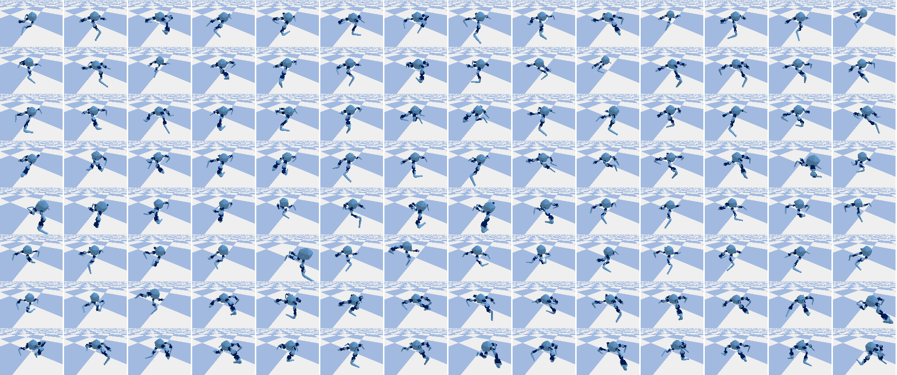

# Reconfigurable Robot Identification from Motion Data

Upon publishing our paper, we will release a comprehensive dataset that includes 200,000 robot CAD and URDF files.

*An image showcasing a part of robots in our dataset.*

## Getting Started

To replicate the results presented in our paper, please follow these steps:

1. Install the necessary dependencies as listed in `requirements.txt`.
2. Navigate to the `meta_sm` directory and execute `python eval.py` to evaluate the model.
3. Review `model.py` to understand our model architecture in detail.

### Key Contributions:

- A meta-self-modeling approach that enables understanding and prediction of diverse robot morphologies from proprioceptive data.
- The design of a 12-DoF reconfigurable legged robot and the creation of a comprehensive dataset to study the relationship between motion dynamics and morphology.
- 
## Experimentation

Dynamic data collection and model evaluation were conducted in both simulated environments and real-world settings, confirming the model's effectiveness in understanding and predicting robot configurations from motion data.

### Supplementary Videos

For motivation, please take a look at the supplementary videos included in our submission. These videos provide a detailed overview of our paper.

## Citation

If you find our work useful, please consider citing it as follows:

